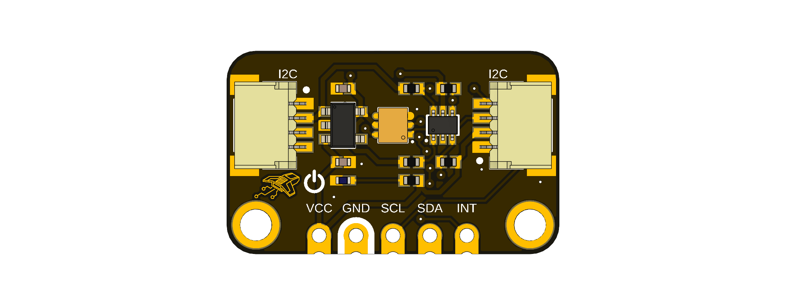

# DevLab: I2C TSL2591 Light Sensor Module

## Introduction

The DevLab: I2C TSL2591 Light Sensor Module is a compact and versatile development board designed for prototyping and learning about light sensing applications. It features the TSL2591 digital light sensor, which provides accurate measurements of ambient light levels. This module is ideal for students, hobbyists, and developers looking to explore light sensing technology and integrate it into their projects. With its easy-to-use I2C interface, the DevLab: I2C TSL2591 Light Sensor Module can be easily connected to microcontrollers and development boards for a wide range of applications, including environmental monitoring, smart lighting systems, and more.

  
  
<em>Development Board</em>

### Quick Setup

## Overview

| Feature           | Description                                         |
|-------------------|-----------------------------------------------------|

## Applications

##  License

All hardware and documentation in this project are licensed under the **MIT License**.  
See [`LICENSE.md`](LICENSE.md) for details.

  Template created by UNIT Electronics

